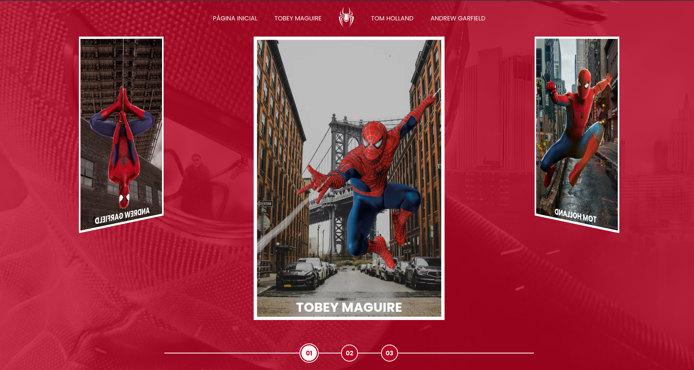
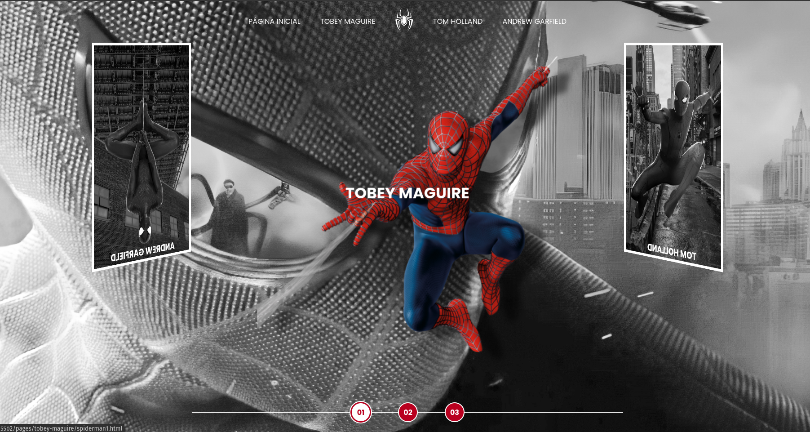
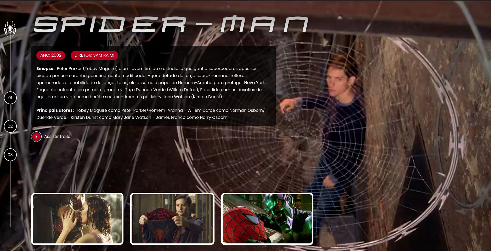

# **Multiverse Spider-Man**

Um projeto interativo e visualmente rico, inspirado no **multiverso do Homem-Aranha**. Esta aplicação foi criada como parte de um desafio da plataforma [Digital Innovation One (DIO)](https://www.dio.me/), utilizando **HTML**, **CSS** e **JavaScript** para explorar as habilidades de front-end.

---

## **🎯 Objetivo do Projeto**
O objetivo deste projeto é criar um layout dinâmico que apresenta os diferentes universos do Homem-Aranha, destacando os filmes de **Tobey Maguire**, **Andrew Garfield** e **Tom Holland**. Durante a construção do site, foram exploradas:
- **Animações e efeitos CSS**: Aplicação de transições e sobreposições para uma experiência interativa.
- **Design responsivo**: Utilização de técnicas modernas de posicionamento para suportar dispositivos móveis e desktop.
- **Organização de conteúdo multimídia**: Inclusão de imagens, vídeos e estilos personalizados.

---

## **🚀 Tecnologias Utilizadas**
- **HTML5**: Estruturação do conteúdo.
- **CSS3**: Estilização e animações.
- **JavaScript**: Interatividade e manipulação dinâmica.
- **Figma**: Protótipo de design visual ([acesse aqui](https://www.figma.com/file/GjvdE0uob68X6pEHqw2pY8/Multiverse-Spider-Man)).

---

## **🎥 Demonstração**





---

## **📂 Estrutura do Projeto**
```plaintext
.
├── .vscode/
│   └── settings.json
├── assets/
│   ├── demo/
│   ├── css/
│   │   ├── components/
│   │   │   ├── _gallery.css
│   │   │   ├── _link-button.css
│   │   │   ├── _navigator.css
│   │   │   └── _pills.css
│   │   ├── global.css
│   │   ├── home-page-styles.css
│   │   ├── internal.css
│   │   └── reset.css
│   ├── images/
│   │   ├── icons/
│   │   ├── spiderman-andrew/
│   │   ├── spiderman-tobey/
│   │   ├── spiderman-tom/
│   │   └── [outras imagens]
│   ├── scripts/
│   │   └── script.js
│   └── videos/
│       └── [trailer dos filmes]
├── pages/
│   ├── andrew-garfield/
│   │   ├── spiderman1.html
│   │   └── spiderman2.html
│   ├── tobey-maguire/
│   │   ├── spiderman1.html
│   │   ├── spiderman2.html
│   │   └── spiderman3.html
│   └── tom-holland/
│       ├── spiderman1.html
│       ├── spiderman2.html
│       └── spiderman3.html
└── index.html
```

---

## **🌟 Inspirado Por**
- Este projeto faz parte do curso "Multiverso Spider-Man" da [DIO](https://www.dio.me/).

---
